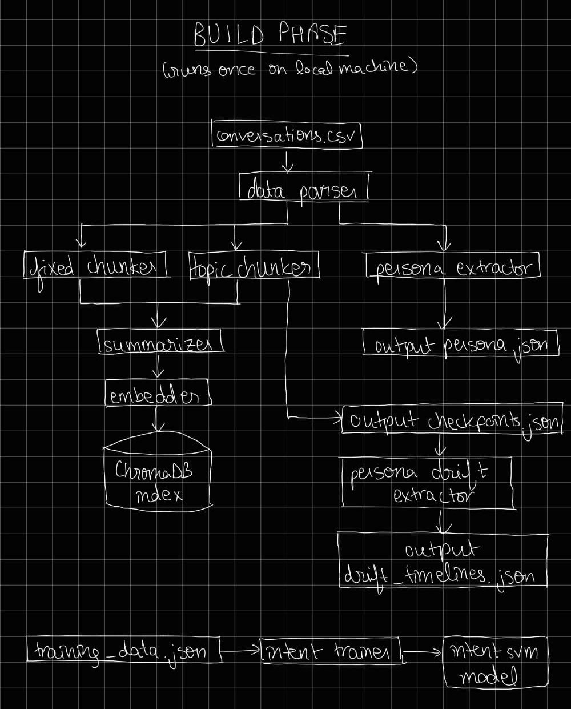
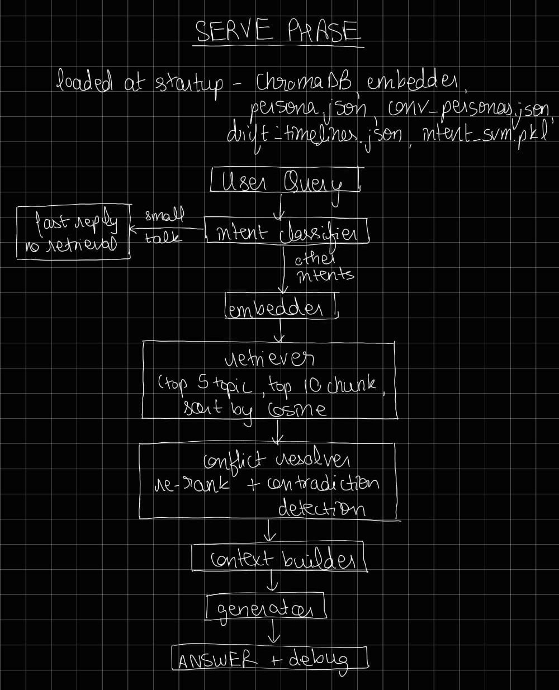

# System Architecture

This document describes the full technical architecture of both phases of the Persona-Aware RAG Chatbot — the base system (Round 1) and the intelligence layer (Round 2).

---

## The Two Phases

The system is split into two fundamentally different phases that run at different times and in different environments.

```
┌─────────────────────────────────────────────────────────────────┐
│  BUILD PHASE  (runs once, on local machine)                     │
│                                                                 │
│  Raw data → process → generate artifacts → save to disk         │
│                                                                 │
│  Heavy compute. No API calls. No user-facing UI.                │
└─────────────────────────────────────────────────────────────────┘
                              │
                              │  artifacts (files on disk)
                              ▼
┌─────────────────────────────────────────────────────────────────┐
│  SERVE PHASE  (runs continuously, locally or on HF Spaces)      │
│                                                                 │
│  User query → load artifacts → retrieve → generate → respond    │
│                                                                 │
│  Lightweight. Fast. Groq API for LLM. Gradio for UI.            │
└─────────────────────────────────────────────────────────────────┘
```

| Phase | Timing | Environment | Focus |
|---|---|---|---|
| **Build** | Once | Local machine | Heavy compute, no API calls, artifact generation |
| **Serve** | Continuous | Local / HF Spaces | Low-latency, Groq API, Gradio UI, RAG inference |

---

## Full System Architecture

Components are annotated with the round that introduced them:
`[R1]` = base system · `[R2]` = intelligence layer (new in Round 2)

---

### Build Phase — Complete Pipeline

Runs once, offline, on your local machine. No LLM calls. Heavy compute.



**data/parser.py [R1]** reads `conversations.csv` and converts it into structured Conversation and Message objects used by every downstream step.

**topic_chunker.py [R1]** detects topic boundaries within each conversation using a hybrid scoring approach — 70% cosine similarity between adjacent message windows and 30% TF-IDF keyword overlap. It uses a sliding window of 5 messages and an adaptive threshold per conversation, meaning noisier conversations get a more lenient boundary threshold. This produces variable-length segments that follow natural topic shifts.

**fixed_chunker.py [R1]** splits every conversation into fixed 100-message windows regardless of topic. This is purely position-based — no NLP — and acts as a fallback retrieval path for queries where topic boundaries are unreliable.

**summarizer.py [R1]** generates extractive summaries for each chunk. It computes IDF (inverse document frequency) scores across the full corpus so that rare, distinctive words score higher. The top 3 messages with the highest average IDF score are selected as the summary. This surfaces the most content-specific messages rather than the most common ones.

**embedder.py [R1]** runs `all-MiniLM-L6-v2` (80MB, CPU-only) to produce 384-dimensional embeddings for all summaries and raw message chunks. The same model instance is reused across build and serve phases.

**indexer.py → ChromaDB [R1]** stores all embeddings in a persistent ChromaDB database with three collections: `topic_summaries` (segment summaries with metadata), `fixed_summaries` (100-msg window summaries), and `message_chunks` (groups of 5–10 raw messages). Total size ~315MB.

**persona/extractor.py [R1]** orchestrates four parallel extractors against each conversation:
- `facts.py` — spaCy dependency parsing to identify SVO triples where the subject is a first-person pronoun, capturing self-referential statements like "I have a dog"
- `traits.py` — VADER sentiment analysis averaged per conversation, mapped to personality trait labels (e.g. question rate > 0.4 → curious)
- `interests.py` — LDA unsupervised topic modelling to cluster messages into interest topics without predefined categories
- `style.py` — statistical metrics: average message length, vocabulary richness, question rate, exclamation rate

**persona/drift.py [R2]** reads `topic_checkpoints.json` to get the segment boundaries per conversation. For each speaker within each conversation, it computes VADER sentiment and style stats per segment, then compares adjacent segments. A drift event is flagged when `|Δsentiment| > 0.15` or `|Δstyle| > 0.20`. This produces a timeline of emotional and stylistic shifts for every speaker. Outputs `drift_timelines.json` (~62MB, 21,843 timelines, 48,488 drift events).

**intent/train.py [R2]** loads 500 labelled training examples across 5 intent classes (reminder, action-item, emotional-support, small-talk, unknown), embeds them using the same `all-MiniLM-L6-v2` model, and trains an `SVC(kernel='rbf', probability=True)` classifier with 5-fold cross-validation. Achieves 100% test accuracy. Saves the fitted model to `outputs/intent/intent_svm.pkl`.

**Artifacts produced:**

| File | Size | Used by |
|---|---|---|
| `outputs/index/` | ~315MB | Serve phase retriever |
| `outputs/checkpoints/` | ~few MB | Drift detector |
| `outputs/persona/personas.json` | ~few MB | Context builder (aggregate Tier 2) |
| `outputs/persona/conv_personas.json` | ~few MB | Context builder (per-conversation Tier 1) |
| `outputs/persona/drift_timelines.json` | ~62MB | Context builder (mood shift context) |
| `outputs/intent/intent_svm.pkl` | ~few KB | Intent classifier at serve time |

---

### Serve Phase — Complete Pipeline

Runs continuously, locally or on HF Spaces. Fast. Groq API for LLM generation.



All six artifacts are loaded once at startup and held in memory. No disk reads during query handling.

**intent/classifier.py [R2]** embeds the incoming query using the already-loaded `all-MiniLM-L6-v2` instance (~0ms extra cost), then calls `SVM.predict_proba()` to get a `(label, confidence)` pair. If confidence is below 0.55 the label falls back to `unknown`. If the label is `small-talk`, the query is handled immediately with a lightweight redirect reply — no retrieval, no Groq call, total latency under 200ms. All other intents continue to the retrieval pipeline.

**embedder.py [R1]** (serve-time use) embeds the query into a 384-dimensional vector for similarity search against the ChromaDB collections.

**retriever.py [R1]** runs three parallel ChromaDB searches — top-5 from `topic_summaries`, top-10 from `message_chunks`, top-3 from `fixed_summaries` — combines the results, deduplicates, and sorts by cosine similarity. Returns a `RetrievalContext` object containing ranked results with metadata.

**conflict_resolver.py [R2]** takes the `RetrievalContext` and does two things. First, it re-ranks all results using a composite score: `0.40×cosine + 0.30×entity_overlap + 0.20×emotion_weight + 0.10×recency`. Entity overlap is the fraction of query entities that appear in the chunk; emotion weight is the absolute VADER compound score; recency is the conversation ID normalised to [0,1]. The original cosine score is preserved in metadata so both are visible in the debug panel. Second, it checks the top 8 results pairwise (28 pairs maximum) for contradictions: a negation clash is when an entity is negated in one chunk but not the other; a sentiment spread is when `|VADER(A) − VADER(B)| ≥ 0.60`. Flagged pairs are attached to the `ResolvedContext` as `contradiction_flags[]`.

**context_builder.py [R1+R2]** assembles the full context string passed to the LLM, in this order:
1. `[R2]` TONE GUIDANCE — a short hint based on the intent label (e.g. "be empathetic and acknowledge feelings" for emotional-support, "respond with a concise bullet list" for action-item)
2. `[R2]` Contradiction summary — if any flags exist, a warning listing the conflicting entities and their sentiment polarity
3. `[R1]` Aggregate persona section — communication style stats averaged across the full dataset
4. `[R1]` Per-conversation facts — specific facts, traits, and interests for the conversations retrieved
5. `[R2]` PERSONA DRIFT TIMELINE — the mood shift timeline for each retrieved conversation's speakers
6. `[R1]` Retrieved text — the actual chunk content, formatted with conversation ID and composite score

**generator.py [R1+R2]** sends the assembled context and user query to the Groq API (`llama-3.3-70b-versatile`). The system prompt was updated in Round 2 to explicitly instruct the LLM to act on the tone hint, flag any contradictions in its answer, and reference the drift timeline when describing emotional context. Fallback chain: OpenAI → Gemini → static template. The system always returns something.

**Debug panel [R1+R2]** is an expandable section in the Gradio UI showing: intent label and confidence percentage `[R2]`, lookup type (semantic / direct conv ID) `[R1]`, contradiction flags with entity names and sentiment polarity `[R2]`, top retrieved segments with both composite and original cosine scores side by side `[R2]`, a `⚠` marker on any chunk involved in a contradiction `[R2]`, and the full drift timeline per conversation `[R2]`.

---

## On-Device Storage vs Cloud Sync

### What stays local (never syncs)

These are build artifacts — large, machine-generated, and reproducible from source data:

| Artifact | Size | Why local-only |
|---|---|---|
| `outputs/index/` (ChromaDB) | ~315MB | Rebuilt from conversations.csv |
| `outputs/persona/drift_timelines.json` | ~62MB | Rebuilt by `python main.py drift` |
| `outputs/persona/personas.json` | ~few MB | Rebuilt by `python main.py persona` |
| `outputs/persona/conv_personas.json` | ~few MB | Same |
| `intent/training_data.json` | ~200KB | Version-controlled in git |
| `.env` (API keys) | — | Never syncs anywhere, ever |

### What syncs to Hugging Face Spaces

Only code and small model artifacts:

| File | How it gets there |
|---|---|
| All Python source files (`serve/`, `retrieval/`, `intent/`, etc.) | `git push` to HF repo |
| `config.py` | `git push` |
| `outputs/intent/intent_svm.pkl` | Included in git (small file) |
| `requirements_serve.txt` | `git push` |
| `outputs/index/` (ChromaDB) | Uploaded once to HF Space persistent storage |
| `outputs/persona/*.json` | Uploaded once to HF Space persistent storage |

### Conflict resolution rules

| Conflict type | Resolution |
|---|---|
| **SVM model retrained locally** | Increment filename version (`intent_svm_v2.pkl`), update `config.py`, push both. HF Space picks up on restart. |
| **Embedding model changed** | Never change `EMBEDDING_MODEL` without rebuilding the entire index. The config constant is the contract between code and ChromaDB. |
| **Drift timelines updated locally** | Run `python main.py drift`, then manually upload new `drift_timelines.json` to HF Space persistent storage. No auto-sync. |
| **New training data added** | Re-run `python main.py intent-train` → new `.pkl` → push. |

### The key principle

```
Local machine  =  build environment  →  produces all artifacts
HF Spaces      =  serve environment  →  consumes pre-built artifacts

Code syncs via git.
Large artifacts sync manually (once, or when rebuilt).
Small model files sync with code.
API keys never leave the local machine.
```

---

## Module Dependency Map

```
config.py  ←─────────────────────────────── all modules read from here
    │
    ├── data/parser.py
    │       └── data/models.py
    │
    ├── chunking/topic_chunker.py
    ├── chunking/fixed_chunker.py
    ├── summarizer/summarizer.py
    │
    ├── retrieval/embedder.py
    │       └── retrieval/indexer.py
    │       └── retrieval/retriever.py  ←── RetrievalContext, RetrievalResult
    │               └── retrieval/conflict_resolver.py  ←── ResolvedContext
    │
    ├── persona/schema.py  ←── DriftEvent, ConversationTimeline (Round 2)
    │       └── persona/drift.py       (Round 2)
    │       └── persona/extractor.py
    │               ├── persona/facts.py
    │               ├── persona/traits.py
    │               ├── persona/interests.py
    │               └── persona/style.py
    │
    ├── intent/classifier.py           (Round 2)
    │       └── intent/train.py        (Round 2)
    │
    ├── generation/generator.py
    │
    └── serve/app.py
            ├── serve/context_builder.py
            ├── retrieval/retriever.py
            ├── retrieval/conflict_resolver.py  (Round 2)
            ├── intent/classifier.py            (Round 2)
            └── generation/generator.py
```

---

## Key Design Constraints

| Constraint | Decision |
|---|---|
| **Build phase must be fully offline** | No LLM calls in build. IDF summarization, VADER sentiment, spaCy NER — all local. |
| **Serve phase must be fast** | Intent classification: ~5ms (local SVM, no API). Conflict resolution: ~10ms (VADER + token ops). Retrieval: ~50ms (ChromaDB). LLM: ~300-800ms (Groq). |
| **No extra models at serve time** | Intent SVM reuses the already-loaded `all-MiniLM-L6-v2` embedder. Conflict resolver reuses VADER (already loaded by drift detector). |
| **Graceful degradation** | If SVM pickle missing → all queries return `("unknown", 0.0)`. If drift timelines missing → drift section omitted silently. If Groq fails → template fallback. |
| **HF Spaces memory limit** | Serve-phase dependencies are kept minimal (`requirements_serve.txt`). The 80MB embedding model is the largest memory cost. ChromaDB runs in embedded mode (no separate server process). |
