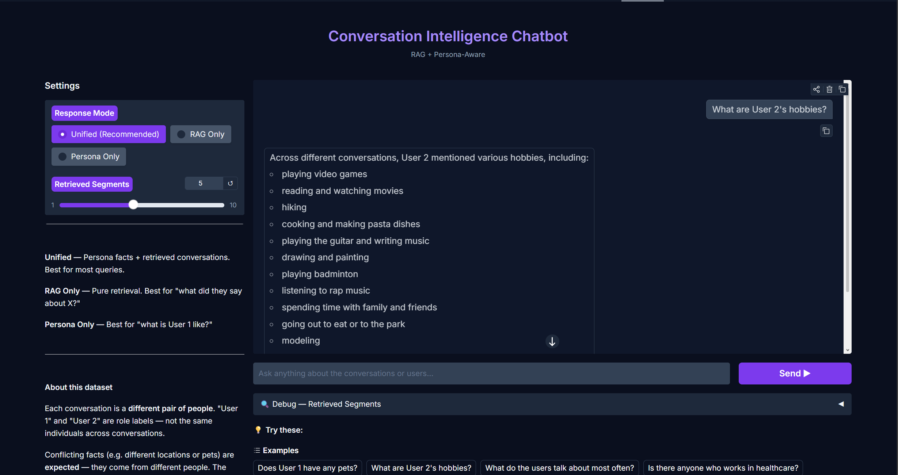
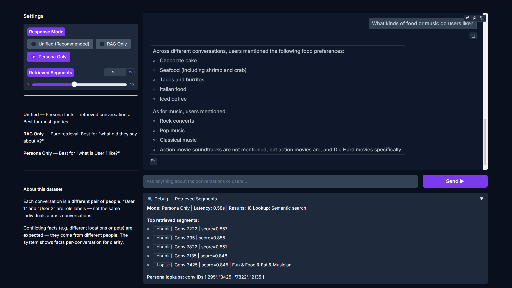
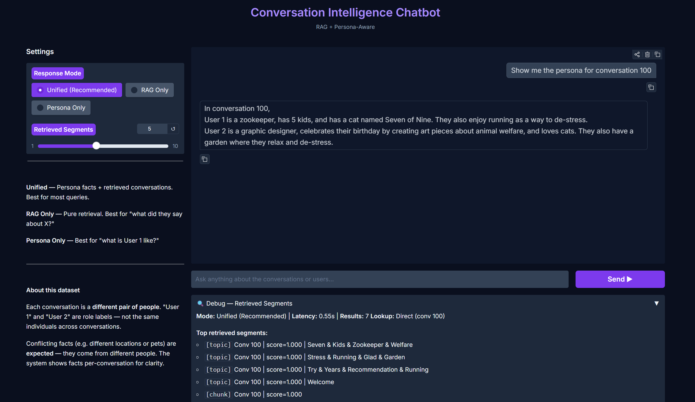

# Persona-Aware RAG Chatbot

A conversational AI system that answers questions about a dataset of 11,000+ conversations between pairs of people. It combines **Retrieval-Augmented Generation (RAG)** with **persona extraction** to provide accurate, context-rich answers.

**Live Demo:** [Hugging Face Space](https://huggingface.co/spaces/prisha7217/RAG_Chatbot)

---

## Screenshots


*Figure 1: Semantic RAG across the dataset using Unified Mode.*


*Figure 2: The Debug Panel showing RAG retrieval chunks and vector similarity scores.*


*Figure 3: Conflict resolution via direct conversation lookup metadata filtering.*

## Video Demo

[Demo Video](https://www.loom.com/share/e7159bd8cf5c45d08fbeaee60b67fa01)

---

## Table of Contents

- [How It Works — The Big Picture](#how-it-works--the-big-picture)
- [How Topic Detection Works](#how-topic-detection-works)
- [How the Summarizer Works](#how-the-summarizer-works)
- [How Retrieval Works](#how-retrieval-works)
- [How Persona is Built](#how-persona-is-built)
- [How the Chatbot Generates Answers](#how-the-chatbot-generates-answers)
- [Project Structure](#project-structure)
- [Setup & Installation](#setup--installation)
- [How to Run Everything](#how-to-run-everything)
- [Configuration](#configuration)
- [About the Dataset](#about-the-dataset)
- [Design Decisions](#design-decisions)

---

## How It Works — The Big Picture

The system runs in **two phases**:

### Phase 1 — Build (runs once, on your machine)

This is the heavy lifting. It reads the raw conversation data, breaks it into meaningful chunks, summarises each chunk, extracts persona information about the people in each conversation, and builds a searchable vector index. **No LLM is needed for this phase** — everything is done using custom NLP logic.

### Phase 2 — Serve (runs on the cloud)

This is the lightweight chatbot. When a user asks a question, it searches the pre-built index, pulls up the most relevant conversation segments and persona facts, and uses Groq's LLM API to format a clean answer. The LLM doesn't do any thinking or retrieval — it just takes the data our system found and presents it nicely.

```
Phase 1 (Build)                              Phase 2 (Serve)
─────────────────                            ─────────────────
conversations.csv                            User asks a question
       │                                            │
       ▼                                            ▼
   Parser ──► Topic Chunker                  Embed the question
       │           │                                │
       │      Summarizer                     Search ChromaDB
       │           │                          (find relevant chunks)
       │      ChromaDB Index ──────────────►       │
       │                                     Look up persona facts
       ▼                                            │
   Persona Extractor                         Build context string
       │                                            │
   personas.json ──────────────────────────►  Send to Groq LLM
   conv_personas.json                               │
                                              Format & display answer
```

---

## Tech Stack & Architecture Specs
- **Embeddings:** `sentence-transformers/all-MiniLM-L6-v2` (Cosine Similarity)
- **Topic Segmentation:** Hybrid sliding-window (Cosine Sim + TF-IDF Jaccard Overlap)
- **Vector Store:** ChromaDB (3 collections: topics, fixed, raw chunks)
- **Summarization:** IDF-weighted Extractive Centroid (No LLM)
- **Persona NLP:** spaCy (`en_core_web_sm`) Dependency Parsing + VADER + sklearn LDA
- **Generator LLM:** Groq API (`llama-3.3-70b-versatile`)
- **UI Framework:** Gradio
- **Deployment:** Hugging Face Spaces

---

## How Topic Detection Works

Each conversation in the dataset covers multiple topics — someone might start by talking about their pets, then shift to their job, then discuss their hobbies. The **Topic Chunker** automatically finds where these topic shifts happen.

### The Hybrid Approach

We use two signals together to detect topic changes:

**Signal 1 — Semantic Similarity (70% weight)**
- Take a sliding window of the last 5 messages
- Compute the average "meaning" of those messages using an embedding model (`all-MiniLM-L6-v2`)
- Compare it to the next message's meaning using cosine similarity
- If the next message is very different in meaning → possible topic change

**Signal 2 — Keyword Overlap (30% weight)**
- Extract the top keywords from the last 5 messages using TF-IDF
- Extract the top keywords from the next message
- Check how many keywords overlap (Jaccard similarity)
- If very few keywords overlap → possible topic change

**Combined Score:**
```
combined_score = 0.7 × semantic_similarity + 0.3 × keyword_overlap
```

When this combined score drops below a threshold, we mark a **topic boundary**.

### Why Two Signals?

Semantic similarity alone can miss cases where someone uses different words to talk about the same thing. Keyword overlap alone can miss cases where the topic genuinely shifted but some words carried over. Together, they catch both types of shifts.

### Safeguards

To prevent bad splits, we have four rules:

| Rule | What it does |
|---|---|
| **Minimum 3 messages** | A topic must have at least 3 messages — prevents noisy 1-message "topics" |
| **Maximum 15 messages** | Forces a split even in long stretches where similarity stays high |
| **Adaptive threshold** | Each conversation gets its own threshold based on its variance — uniform conversations get a looser threshold to still find relative dips |
| **Validation logging** | Conversations that produce only 1 topic get flagged for review |

### What Comes Out

Each detected topic segment becomes a **TopicCheckpoint** — a JSON object containing the messages, a summary, a topic label, and an embedding vector. These are saved to `outputs/checkpoints/topic_checkpoints.json`.

---

## How the Summarizer Works

Once we have topic segments, each one needs a summary. We use **IDF-weighted extractive summarization** — no LLM involved.

### The Approach

1. **Fit a TF-IDF model** on all the messages in the segment
2. **Score each message** by the sum of the IDF values of its words. Messages with rare, content-bearing words score highest
3. **Pick the top 3 highest-scoring messages** — these are the most informative ones
4. **Join them together** — that's the summary

### Why IDF Works Here

IDF (Inverse Document Frequency) directly measures how informative a word is. Common filler words like "yeah", "cool", "hey" appear in almost every message, so they get very low IDF scores. But content-rich words like "radiology", "golden retriever", "Portland" are rare and get high IDF scores.

So a message like *"I'm a fulltime student studying radiology"* scores much higher than *"That's really cool, I agree!"* — which is exactly what we want in a summary.

### Topic Labels

Topic labels are also generated from TF-IDF keywords — the top 2-3 keywords of a segment get joined with " & " to form a label like **"Pets & Animals"** or **"Career & Education"**.

### Why Not Use an LLM?

We intentionally avoided using any LLM in the build phase. The reasoning:
- The build phase should be **self-contained** and not depend on external APIs
- IDF-based scoring is fast (processes ~40,000 summaries in minutes)
- For short conversational messages, extractive summarization works well — the messages are already concise and self-contained

---

## How Retrieval Works

When a user asks a question, the retrieval system finds the most relevant conversation segments from the pre-built index.

### The Vector Database (ChromaDB)

During the build phase, all summaries and message chunks are embedded and stored in ChromaDB with **3 separate collections**:

| Collection | What's in it | Best for |
|---|---|---|
| `topic_summaries` | Summary of each detected topic segment + metadata | "What did they talk about regarding pets?" |
| `fixed_summaries` | Summary of every 100 messages (position-based) | "What happened in the first 500 messages?" |
| `message_chunks` | Groups of 5-10 raw messages | Finding specific quotes or exact wording |

### How a Query Gets Answered

```
User: "Does anyone have a dog?"
         │
         ▼
    1. Embed the question using the same model (all-MiniLM-L6-v2)
         │
         ▼
    2. Search all 3 ChromaDB collections
       → topic_summaries: top 5 matches
       → message_chunks:  top 10 matches
       → fixed_summaries: top 3 matches
         │
         ▼
    3. Rank all results by cosine similarity score
         │
         ▼
    4. Remove duplicates (overlapping chunks from the same conversation)
         │
         ▼
    5. Return the best matches as context for the answer generator
```

### Direct Conversation Lookup

If you ask about a specific conversation (e.g., *"Tell me about conversation 42"* or *"What did the people in #42 talk about?"*), the system detects the conversation ID in your query and bypasses semantic search entirely. Instead, it does a direct metadata filter on ChromaDB to pull all stored chunks for that specific conversation. This gives you a coherent view of one pair of people without mixing in other conversations.

### Embedding Model

We use `sentence-transformers/all-MiniLM-L6-v2` — an 80MB model that runs on CPU. The same model is used during both build (to embed summaries) and serve (to embed queries), which ensures consistency.

---

## How Persona is Built

Persona extraction is the system that figures out **who the people in each conversation are** — their personality, habits, interests, communication style, and personal facts.

### The Two-Tier Architecture

This is one of the most important design decisions. We extract persona at **two levels**:

**Tier 1 — Per-Conversation Persona** (`conv_personas.json`)
- Facts about the specific people in each conversation
- Example: In conversation 42, User 1 mentioned having a golden retriever and living in Portland
- These are locally coherent — no contradictions because it's one pair of people

**Tier 2 — Aggregate Persona** (`personas.json`)
- Statistical summaries across ALL conversations
- Example: The average User 1 writes 45-word messages and uses positive language 72% of the time
- Only signals that make sense across many different people belong here (communication style, sentiment patterns)

### Why Two Tiers?

"User 1" and "User 2" are just role labels — they represent **thousands of different people** across conversations. If you merge all their facts together, you get contradictions (User 1 "has a dog" AND "has a cat" AND "lives in New York" AND "lives in Portland"). That's because those are all different people.

So personal facts stay at the per-conversation level (Tier 1), while statistical patterns that genuinely aggregate well go into Tier 2.

### The Four Extractors

Each extractor handles a different dimension of persona:

#### 1. Facts Extractor (`persona/facts.py`)

Uses **spaCy dependency parsing** to find self-referential statements. Instead of brittle regex patterns, it parses the grammatical structure of each sentence:

```
"I have a dog named Buddy" 
   → Subject: "I"  Verb: "have"  Object: "dog"  
   → Category: pet
   → Fact: "have a dog named Buddy"

"I'm studying radiology at UCLA"
   → Subject: "I"  Verb: "studying"  Object: "radiology"
   → Category: education
   → Fact: "studying radiology at UCLA"
```

It only looks for first-person statements (I, my, me) to extract what people say about themselves. The category rules cover 12 categories: occupation, pet, location, hobby, family, food, music, education, health, achievement, entertainment, and relationships.

Also uses **spaCy Named Entity Recognition (NER)** to catch locations, organizations, and people's names that the SVO parsing might miss.

#### 2. Traits Extractor (`persona/traits.py`)

Uses **VADER sentiment analysis** + statistical thresholds to classify personality traits. No machine learning model needed — when someone's messages are 80% positive sentiment, they *are* positive. The traits it detects:

- Positive / Negative (based on VADER sentiment scores)
- Curious (based on question mark frequency)
- Expressive (based on exclamation mark and emoji usage)
- Talkative (based on average message length)
- Formal / Informal (based on vocabulary and greeting patterns)

Each trait comes with a confidence score that scales with how much evidence was seen.

#### 3. Interest Discovery (`persona/interests.py`)

Uses **LDA (Latent Dirichlet Allocation)** — an unsupervised topic discovery algorithm. You feed it all the messages and it automatically clusters them into topics:

```
Topic 0: dog, cat, pet, animal, walk     → "Pets"
Topic 1: cook, recipe, food, restaurant  → "Cooking & Food"
Topic 2: run, hike, gym, workout         → "Fitness"
Topic 3: book, read, novel, author       → "Reading & Books"
```

These topics emerge from the data itself — we don't tell it what to look for. We expanded the stopword list to filter out sentiment filler words ("glad", "fun", "enjoy") so LDA focuses on actual content words.

#### 4. Communication Style (`persona/style.py`)

Pure statistical analysis — no ML or NLP models needed:

- Average message length (in words)
- Vocabulary richness (unique words / total words)
- Question ratio (how often they ask questions)
- Exclamation ratio (how much enthusiasm)
- Formality score (formal vs casual language)
- Conversation initiator ratio (how often they speak first)

### Batched Processing

All spaCy processing uses `nlp.pipe()` with batched processing (batch size 64) instead of processing one message at a time. This shares tokenizer and model computation across the batch and reduced extraction time from ~20 minutes to ~8 minutes on the full dataset of 191,000 messages.

---

## How the Chatbot Generates Answers

### Groq — The Primary LLM

We use **Groq** (`llama-3.3-70b-versatile`) as the primary LLM for answer generation. Groq was chosen because:
- **Speed**: Sub-second inference times (much faster than OpenAI or Gemini)
- **Free tier**: 14,400 requests/day, 30 requests/minute — more than enough
- **Quality**: The 70B parameter Llama model produces high-quality natural language

The LLM receives a **strict system prompt** that tells it:
- Each conversation is a different pair of people — don't merge facts
- Only use information from the provided context — never make things up
- Attribute facts to specific conversations when possible
- If the context doesn't have the answer, say so clearly

### Fallback Chain

If Groq is unavailable, the system falls back through:

```
Groq (primary) → OpenAI → Gemini → Template Fallback
```

The template fallback produces structured output without any LLM — it extracts facts from the persona data, groups them by conversation, and shows relevant conversation excerpts. It's not as polished as LLM output, but the chatbot never goes down.

### The Three Modes

| Mode | What it does | Best for |
|---|---|---|
| **Unified** (default) | Combines persona facts + retrieved conversation excerpts | Most queries |
| **RAG Only** | Only shows retrieved conversation segments, no persona | "What exactly did they say about X?" |
| **Persona Only** | Only shows extracted persona data, no raw conversations | "What kind of person is User 1?" |

### Context Building

Before the LLM sees anything, the **Context Builder** (`serve/context_builder.py`) assembles a structured context string:

1. **Aggregate persona section** — statistical communication profiles (only for personality queries)
2. **Per-conversation persona facts** — facts from the specific conversations that were retrieved
3. **Retrieved text** — the actual conversation excerpts from ChromaDB

This context string is what gets sent to Groq along with the user's question. The LLM's only job is to read this pre-assembled context and write a clear answer.

---

## Project Structure

```
rag_task/
├── main.py                    # CLI entry point: python main.py build | persona | serve
├── config.py                  # All configuration, paths, and environment variables
│
├── data/                      # Data parsing
│   ├── parser.py              # Reads conversations.csv → structured Conversation objects
│   └── models.py              # Pydantic data models (Message, Conversation, Checkpoints)
│
├── chunking/                  # Topic detection & segmentation
│   ├── base.py                # Abstract chunker interface
│   ├── topic_chunker.py       # Hybrid cosine similarity + keyword shift detection
│   └── fixed_chunker.py       # Simple 100-message fixed checkpoints
│
├── summarizer/
│   └── summarizer.py          # IDF-weighted extractive summarization (no LLM)
│
├── persona/                   # Persona extraction pipeline
│   ├── extractor.py           # Main orchestrator — runs all extractors
│   ├── facts.py               # spaCy dependency parsing → SVO fact extraction
│   ├── traits.py              # VADER sentiment → personality trait classification
│   ├── interests.py           # LDA unsupervised topic discovery
│   ├── style.py               # Statistical communication style analysis
│   ├── values.py              # Value and belief extraction
│   ├── events.py              # Life event detection
│   └── schema.py              # Pydantic schemas for UserPersona & ConversationPersona
│
├── retrieval/                 # Vector search & indexing
│   ├── embedder.py            # sentence-transformers wrapper (all-MiniLM-L6-v2)
│   ├── indexer.py             # Builds ChromaDB collections from checkpoints
│   └── retriever.py           # Query → search → rank → return results
│
├── generation/
│   └── generator.py           # LLM answer generation (Groq primary, with fallbacks)
│
├── serve/                     # Chatbot UI
│   ├── app.py                 # Gradio web interface with 3 modes + debug panel
│   └── context_builder.py     # Assembles persona + RAG context for the LLM
│
├── outputs/                   # All generated artifacts (created by build & persona phases)
│   ├── checkpoints/           # Topic & fixed checkpoint JSONs
│   ├── persona/               # personas.json + conv_personas.json
│   └── index/                 # ChromaDB vector database (~315MB)
│
├── logs/
│   └── decision_log.md        # Design decisions with rationale & alternatives
│
├── tests/                     # Test suite
├── requirements.txt           # Build phase dependencies
└── requirements_serve.txt     # Serve phase dependencies (minimal)
```

---

## Setup & Installation

### Prerequisites

- Python 3.11+
- Git with [Git LFS](https://git-lfs.github.com/) (for large index files)
- ~2GB disk space (for models + index)

### 1. Clone the Repository

```bash
git clone https://github.com/prisha7217/RAG_Chatbot.git
cd RAG_Chatbot
git lfs pull   # Downloads the large ChromaDB index files
```

### 2. Create a Virtual Environment

```bash
python -m venv venv

# Windows
venv\Scripts\activate

# macOS/Linux
source venv/bin/activate
```

### 3. Install Dependencies

**For running the full build pipeline + chatbot:**
```bash
pip install -r requirements.txt
python -m spacy download en_core_web_sm
```

**For running the chatbot only** (if you already have the pre-built artifacts in `outputs/`):
```bash
pip install -r requirements_serve.txt
```

### 4. Set Up API Keys

The chatbot uses Groq for natural language answers. Get a free key at [console.groq.com](https://console.groq.com).

**Option A — Environment variable (temporary, per terminal session):**
```powershell
$env:GROQ_API_KEY = "gsk_your_key_here"
```

**Option B — `.env` file (persistent, recommended):**

Create a `.env` file in the project root:
```
GROQ_API_KEY=gsk_your_key_here
```

**Option C — System-level (permanent, Windows):**
```powershell
[System.Environment]::SetEnvironmentVariable("GROQ_API_KEY", "gsk_your_key_here", "User")
```

> **Note:** The chatbot works without an API key — it falls back to a template-based response format. But Groq gives much more natural answers.

---

## How to Run Everything

The entire system is controlled through `main.py` with three commands:

### Step 1 — Build the Index

```bash
python main.py build
```

**What this does:**
1. Parses `conversations.csv` into structured conversation objects
2. Runs the Topic Chunker on each conversation to detect topic boundaries
3. Generates the Fixed Chunker's 100-message checkpoints
4. Summarises every segment using IDF-weighted extraction
5. Embeds all summaries using `all-MiniLM-L6-v2`
6. Stores everything in ChromaDB (`outputs/index/`)
7. Saves checkpoints to `outputs/checkpoints/`

**Time:** ~15-20 minutes on CPU, ~5 minutes with GPU  
**Output:** `outputs/index/` (ChromaDB) + `outputs/checkpoints/` (JSON)

### Step 2 — Extract Personas

```bash
python main.py persona
```

**What this does:**
1. Loads all parsed conversations
2. Runs all 4 persona extractors (facts, traits, interests, style)
3. Produces per-conversation personas (Tier 1)
4. Produces aggregate personas (Tier 2)
5. Saves to `outputs/persona/`

**Time:** ~8-10 minutes on CPU  
**Output:** `outputs/persona/personas.json` + `outputs/persona/conv_personas.json`

### Step 3 — Launch the Chatbot

```bash
python main.py serve
```

**What this does:**
1. Loads the embedding model
2. Connects to the ChromaDB index
3. Loads persona data
4. Starts the Gradio web UI on `http://localhost:7860`

**Try these queries:**
- `"Does User 1 have any pets?"` — semantic search across all conversations
- `"Tell me about conversation 42"` — direct lookup for one specific conversation
- `"What is User 1's communication style?"` — aggregate persona data
- `"What do people talk about most?"` — topic-level retrieval

---

## Configuration

All configuration lives in `config.py`. Key settings:

| Setting | Default | Description |
|---|---|---|
| `GROQ_API_KEY` | (from env) | Groq API key for LLM answers |
| `GROQ_MODEL` | `llama-3.3-70b-versatile` | Which Groq model to use |
| `LLM_TEMPERATURE` | `0.3` | Low = sticks closely to provided context |
| `EMBEDDING_MODEL` | `all-MiniLM-L6-v2` | 80MB sentence-transformers model |
| `TOPIC_WINDOW` | `5` | Sliding window size for topic detection |
| `COSINE_WEIGHT` | `0.7` | Weight for semantic similarity signal |
| `KEYWORD_WEIGHT` | `0.3` | Weight for keyword overlap signal |
| `MIN_SEGMENT_MSGS` | `3` | Minimum messages per topic segment |
| `MAX_SEGMENT_MSGS` | `15` | Maximum messages before forced split |

---

## About the Dataset

The dataset (`conversations.csv`) contains **11,003 conversations** between pairs of people, totalling approximately **191,000 messages**.

### Important: "User 1" and "User 2" Are Role Labels

Every conversation has a "User 1" and a "User 2", but these are **not the same people across conversations**. Each row in the CSV is a completely different pair of strangers having a conversation.

This means:
- In conversation 1, User 1 might say they have a dog
- In conversation 2, a completely different person (also labeled User 1) might say they have a cat
- These are not conflicting facts — they're just different people

The chatbot handles this by:
1. Showing facts **per-conversation** so you can see which pair of people said what
2. Clearly labelling that "each conversation is a different pair of people"
3. Supporting direct conversation lookup (`"Tell me about conversation 42"`) for coherent, single-pair answers

---

## Deployment

The chatbot is deployed on **Hugging Face Spaces** (free tier). The deployment only contains the serve-phase code and pre-built artifacts — not the full build pipeline.

**Live:** [https://huggingface.co/spaces/prisha7217/RAG_Chatbot](https://huggingface.co/spaces/prisha7217/RAG_Chatbot)

---

## Dependencies

### Build Phase
```
sentence-transformers    # Embedding model
chromadb                 # Vector database
spacy                    # Dependency parsing & NER
scikit-learn             # TF-IDF, cosine similarity, LDA
vaderSentiment           # Sentiment analysis
pydantic                 # Data validation
numpy                    # Numerical operations
```

### Serve Phase (minimal)
```
sentence-transformers    # Query embedding
chromadb                 # Vector lookup
gradio                   # Web UI
groq                     # Primary LLM (Llama 3.3 70B)
pydantic                 # Data models
python-dotenv            # Local .env file loading
```
